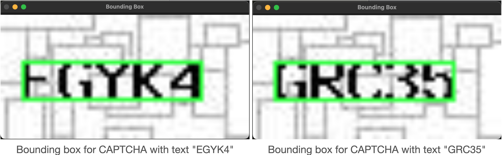
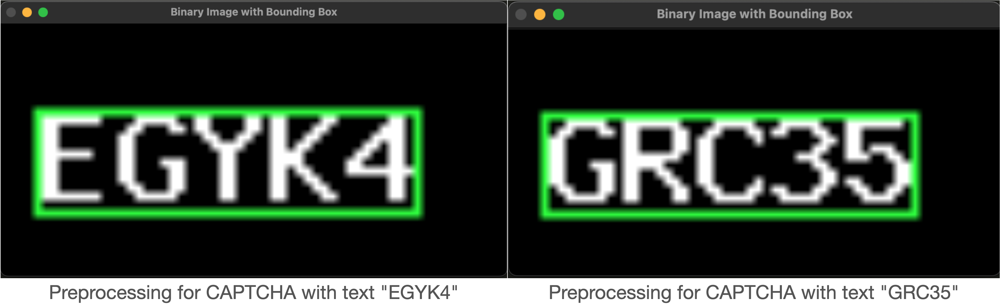
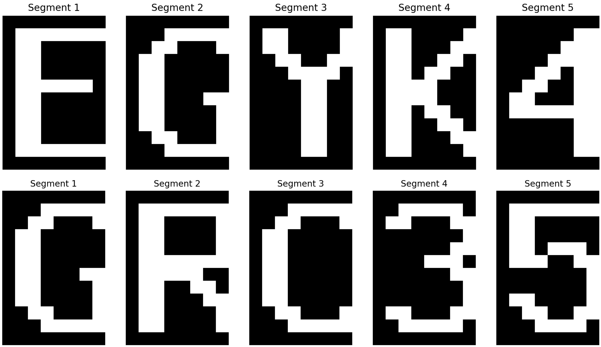

# CAPTCHA Solver

This project implements a simple CAPTCHA recognition system to solve a specific type of CAPTCHA described in the problem statement. The CAPTCHAs are 5-character images with consistent font, spacing, and color properties, using uppercase letters (A-Z) and numerals (0-9). The solution leverages basic image processing and template matching to identify the characters in unseen CAPTCHA images.

## Problem Framing

The CAPTCHA recognition problem can be broken down into a classic pattern recognition task with the following characteristics:
- **Input**: A 256x256x256 RGB image containing a 5-character CAPTCHA.
- **Output**: A 5-character string representing the text in the CAPTCHA.
- **Constraints**:
  - Each CAPTCHA has exactly 5 characters.
  - Characters are from a fixed set: A-Z (uppercase) and 0-9 (36 possible characters).
  - Font, spacing, and structure are consistent across all CAPTCHAs.
  - Background and foreground colors/textures are largely uniform, with no skew or heavy distortion.
- **Provided Data**: A sample set of 25 CAPTCHA images and their corresponding labels, ensuring at least one occurrence of each character (A-Z, 0-9).

The problem is framed as a **template-based character recognition task**:
1. **Training Phase**: Extract character templates from the provided sample set by segmenting the CAPTCHAs and associating each segment with its labeled character.
2. **Inference Phase**: For a new CAPTCHA, preprocess the image, segment it into 5 character regions, and match each region against the templates to predict the text.

This approach avoids complex machine learning models, relying instead on the consistency of the CAPTCHAs and basic image processing techniques, which aligns with the problem's hint that no advanced computer vision background is required.

## Solution Formulation

The solution is implemented in Python using libraries like `PIL`, `NumPy`, and `OpenCV`. It consists of two main scripts:
- `find_area_of_interest.py`: Determines the region in the CAPTCHA images where the characters are located.
- `solution.py`: Implements the `Captcha` class to train on the sample set and perform inference on new CAPTCHAs.

### Step-by-Step Approach

1. **Determine the Character Area** (`find_area_of_interest.py`):
   - **Objective**: Identify the consistent bounding box containing the 5 characters across all CAPTCHAs.
   - **Method**:
     - Preprocess each sample CAPTCHA image by converting it to grayscale and binarizing it (threshold = 50) to isolate the dark text from the lighter background/noise.
     - Find the bounding box of non-zero (text) pixels using `np.nonzero`.
     - Verify consistency across the 25 samples and select a fixed region.
   - **Visualization**:
     Below are visualizations of the bounding boxes found for three sample CAPTCHA images using `find_area_of_interest.py`. The green rectangle highlights the area containing the 5 characters.

     <p align="center"></p>

     Examples of binarized CAPTCHA images with text highlighted by green bounding boxes:

     <p align="center"></p>

   - **Outcome**: The bounding box coordinates `((5, 11), (47, 20))` were heuristically adjusted with small offsets to account for minor variations and noise.

2. **Template Creation** (`solution.py` - `_load_templates`):
   - **Objective**: Build a template for each character (A-Z, 0-9) using the sample set.
   - **Method**:
     - Load each of the 25 sample CAPTCHA images and their labels.
     - Preprocess the images (grayscale, binarize with threshold = 50).
     - Segment the character area into 5 equal regions, accounting for 1-pixel spacing between characters.
     - Associate each segment with its corresponding label and store all instances of each character.
     - Average the pixel values of all instances of a character to create a binary template (thresholded at 0.5).
   - **Preprocessing Visualization**:
     The preprocessing step converts the CAPTCHA image to grayscale and binarizes it to isolate the text. Below are examples of the binary images with the bounding box overlaid for two CAPTCHAs.
     <p align="center"></p>
   - **Segmentation Visualization**:
     After preprocessing, the character area is segmented into 5 regions, each containing one character. Below are examples of the segmented characters for two CAPTCHAs.

     <p align="center"></p>

   - **Outcome**: A dictionary `self.templates` mapping each character to its average binary template.

3. **Inference** (`solution.py` - `__call__`):
   - **Objective**: Predict the text in a new CAPTCHA image.
   - **Method**:
     - Load and preprocess the input image (grayscale, binarize).
     - Segment the fixed character area into 5 regions.
     - For each segment, compute the mean squared error (MSE) against all templates and select the character with the lowest error.
     - Write the predicted 5-character string to the output file.
   - **Outcome**: A text file containing the predicted CAPTCHA text.

### Key Design Choices

- **Preprocessing**: Binarization with a threshold of 50 effectively separates the black text (RGB ≈ (0,0,0)) from the white/light gray background and medium gray noise (grayscale ≈ 190-200).
- **Segmentation**: Fixed coordinates and equal-width segmentation with spacing adjustments ensure accurate character isolation due to the consistent CAPTCHA design.
- **Matching**: Template matching with MSE is simple yet effective given the lack of skew or distortion, and the font consistency.
- **No Machine Learning**: The solution relies on deterministic image processing and averaging, avoiding the need for training a neural network, which suits the problem's simplicity.

## Implementation Details

### Files
- **`find_area_of_interest.py`**:
  - Functions: `preprocess_image`, `find_bounding_box`, `get_area_of_interest`.
  - Used to analyze the sample CAPTCHAs and determine the fixed `self.char_area` in `solution.py`.
- **`solution.py`**:
  - Class: `Captcha` with methods:
    - `__init__`: Initializes character set, dimensions, and templates.
    - `_load_templates`: Builds character templates from the sample set.
    - `_preprocess_image`: Converts to grayscale and binarizes.
    - `_segment_image`: Splits the character area into 5 regions.
    - `_match_template`: Matches a segment to the best template.
    - `__call__`: Performs inference and saves the result.
  - Main function: Tests the solver on the 25 samples and compares predictions with ground truth.

### Dependencies
- `numpy`: Array operations and template averaging.
- `PIL` (Pillow): Image loading and conversion.
- `cv2` (OpenCV): Optional visualization (commented out in the final code).
- `os`, `collections`: File handling and data aggregation.

### Usage
```bash
python solution.py